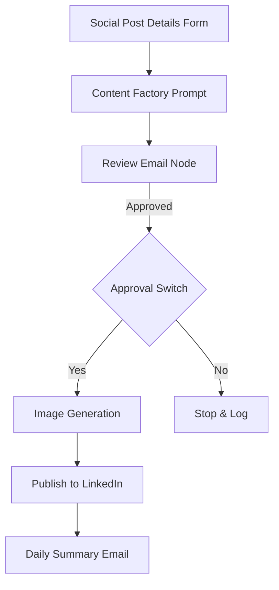

# 🤖 LinkedIn Content Automation Agent — README

Welcome to the repository for building your very own **AI-powered content automation agent**. This project enables you to create, review, and publish LinkedIn posts (and later Instagram) using `n8n`, `GPT-4o`, and external APIs such as SerpAPI and ImgBB.

🔗 **Official blog post (in Hebrew):** [Read full tutorial and walkthrough](https://doron.host/blog/)

---

## 🧭 Prerequisite Guides

Before diving in, we strongly recommend reviewing these foundational tutorials:

* [How to write high-quality prompts](https://doron.host/blog/ai-prompt-guide)
* [What is n8n and how to install it](https://doron.host/blog/what-is-n8n)
* [Introduction to Node.js](https://doron.host/blog/what-is-nodejs)
* [Getting started with n8n](https://doron.host/blog/install-n8n)

---

## 🛠️ System Overview

This automation pipeline is built using `n8n` and includes the following stages:

1. **Social Post Form** – Gather post topics, hashtags, and keywords.
2. **Content Factory (GPT-4o)** – Generate 2 unique posts (LinkedIn & Instagram) per topic.
3. **Review Email** – Send content draft to an approver before publishing.
4. **Image Generation** – Create a relevant image and upload it to ImgBB.
5. **Publishers** – Call LinkedIn API to publish content.
6. **Daily Summary Email** – HTML report on what was published, errors, and usage.

Architecture breakdown is available in the blog post under the section: **"High-Level Architecture"**

---

## ✍️ Writing the Form Description

Under the **Form Description** section in `n8n`, you must clearly describe the writing context to the model. This includes:

* Role and experience (e.g., "Software engineer with 5 years of experience")
* Interests and tone preferences
* Instruction style (first-person, technical, reflective, etc.)

### ✅ Example Prompt:

```text
Instruction:
Write the content as if you are a software engineering student sharing a personal experience from a project or learning process.

Purpose:
To show that you've learned new technologies, engage the reader in your journey, and express genuine enthusiasm.

Key points:
• Use first-person voice  
• Mention specific technologies used (e.g., OAuth, n8n, GPT-4o)  
• Share insights or challenges  
• End with a question or soft call to action
```

### 🔒 Important:

Form fields must use only plain `text` inputs to keep the data clean and unambiguous.

---

## 🧾 JSON Input Format

You will input a JSON object containing your topics:

```json
[
  {
    "Topic": "Prompt Engineering in 2025",
    "formMode": "innovation",
    "submittedAt": "2025-06-01T14:00:00+03:00",
    "Link (optional)": "https://github.com/example",
    "Keywords or Hashtags (optional)": "LLMOps, PromptDesign"
  },
  ...
]
```

Use the edit icon in `Social Post Details` to paste and save this JSON.

---

## 🧠 Content Factory Prompt

The main Prompt node should include this format:

```text
Role & Scope
You are a content-creation AI for {{author}} — automation engineer, full-stack web developer, and product-management enthusiast.
For each Topic you must generate two posts: one for LinkedIn, one for Instagram.

Non-Promotional Guardrails
• Avoid hype words ("must-have", "game-changer")
• Mention pros and cons where relevant
• Write in Hebrew; tech terms & hashtags may remain in Latin

LinkedIn Blueprint
1. Hook – ≤ 15 words
2. Context – 1–2 sentences
3. Insight – practical takeaway
4. Question – discussion point
5. Hashtags – 3–5 (branded + trending)

Instagram Blueprint
1. Visual Idea – one-line image suggestion
2. Caption – 2–3 short lines (≤ 50 words, ≤ 3 emojis)
3. Hashtags – 10 max (5 in caption, 5 in first comment)
```

Use variables such as:

* `{{ $json.Topic }}`
* `{{ $json.formMode }}`
* `{{ $json['Link (optional)'] }}`

---

## 📩 Review Email

This node generates an HTML email containing:

* LinkedIn & Instagram post previews
* Approve / Reject buttons (links)
* Image preview if available

Make sure to set the **To** address correctly. The approval action will trigger a webhook to continue or stop the workflow.

---

## 🖼️ Image Generation (Instagram-style)

The model receives the Instagram caption and turns it into a prompt for a visual AI.

> ✅ Even though this is a "LinkedIn Agent", image prompts from Instagram content are often *much better*. Why not use it?

We then upload the image using:

```
POST https://api.imgbb.com/1/upload
Params:
  - key={{IMGBB_API_KEY}}
  - image={{binary}}
```

The final image URL is stored in the workflow variable.

---

## 📬 Summary Email

This node generates an end-of-day HTML report that includes:

* Published post titles
* Errors (if any)
* API usage estimate (costs)

Use it to track what your automation is doing.

---

## 🔑 API Credentials

All credentials are stored securely in `n8n`. You'll need:

| Service      | How to get it                                   |
| ------------ | ----------------------------------------------- |
| **OpenAI**   | [API Key](https://platform.openai.com/api-keys) |
| **SerpAPI**  | [API Key](https://serpapi.com/dashboard)        |
| **ImgBB**    | [API Key](https://imgbb.com/api)                |
| **Google**   | OAuth2 Client ID + Secret                       |
| **LinkedIn** | App ID + Secret + Access Token                  |

To connect them: open any model node → click **Credentials** → select or create new.

---

## 🧱 Workflow Architecture Diagram



---

## 📣 Final Notes

If you're reading this on GitHub and want to follow the full hands-on guide (with visuals and context), read the full blog post here:
👉 [Read full tutorial (in Hebrew)](https://doron.host/blog/)

Happy automating!

🛠 Built with 💡 by Doron Swisa
